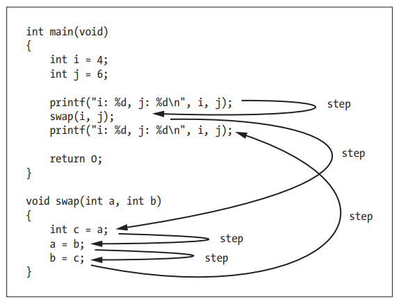
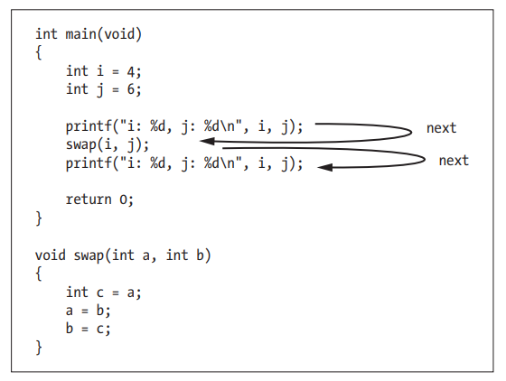

### GDB中的恢复执行

恢复执行的方法分为两种：继续和单步跟踪。

继续又根据是否有条件分为两种：
- 由使用continue组成，使GDB无条件地恢复程序的执行，直到它遇到另外一个断点或程序结束。
- 另一类方法涉及条件：用finish或until命令恢复。在这种情况下，GDB会恢复执行；程序继续运行直到遇到某个预先确定的条件（比如，到达函数的末尾），到达另一个断点或程序结束。

单步跟踪意味着只执行程序“一步”， “一步”可能代表着一 行源代码，或者一条机器指令（依赖于你用的特定命令），可以使用step和next“单步”调试程序。

下面分别对每个命令的常见用法进行解释。

- step 
    继续执行程序直到另一行代码，再中断，把控制权交换 GDB。可以缩写为 s。
    警告：如果在没有调试信息的函数里使用 step 命令，程序执行会继续执行直到有调试信息的一个函数。
    类似的，不会单步进一个没有调试信息的函数。要跳过没有调试信息的函数，用 stepi 命令。如果在这行代码上调用的函数有调试信息，step 会继续中断。换句话说是，step 会进入这行代码所调用的所有函数。如果函数有行号信息，step 命令也只进入这个函数。否则 step 命令就如 next 命令。

    ```
    $ gcc -Wall -g3 -Wall -Wextra -o swapflaw swapflaw.c
    $ gdb swapflaw
    (gdb) break main
    Breakpoint 1 at 0x652: file swapflaw.c, line 7.
    (gdb) run
    Starting program: /home/hexu/git/C.And.Cpp.Debugging.Tutorial/gdb/code/c/swapflaw/swapflaw
    
    Breakpoint 1, main () at swapflaw.c:7
    7               int i = 4;
    (gdb) list
    2       #include <stdio.h>
    3       void swap(int a, int b);
    4
    5       int main( void )
    6       {
    7               int i = 4;
    8               int j = 6;
    9
    10              printf("i: %d, j: %d\n", i, j);
    11              swap(i, j);
    (gdb) next
    8               int j = 6;
    (gdb) next
    10              printf("i: %d, j: %d\n", i, j);
    (gdb) next
    i: 4, j: 6
    11              swap(i, j);
    (gdb) step
    swap (a=4, b=6) at swapflaw.c:19
    19              int c = a;
    (gdb) step
    20              a = b;
    (gdb) step
    21              b = c;
    (gdb) step
    22      }
    (gdb) step
    main () at swapflaw.c:12
    12              printf("i: %d, j: %d\n", i, j);
    (gdb)
    ```

    直观的，step的效果如下：
    

- step count
    继续单步执行，不过执行 count 次。如果执行到一个断点，或者一个与单步跟踪无关的信号在 count 次单步执行发生时，单步执行会立即中断。

- next [count]
    在当前栈帧（最内层）上继续执行到下一行源码行。和 step 相似，但在这行代码上调用的函数将不会中断。程序执行到在原栈层里的另一行代码时会中断。缩写为 n。参数 count 是重复次数，和 step 的一样。

    ```
    $ gcc -Wall -g3 -Wall -Wextra -o swapflaw swapflaw.c
    $ gdb swapflaw
    (gdb) break main
    Breakpoint 1 at 0x652: file swapflaw.c, line 7.
    (gdb) run
    Starting program: /home/hexu/git/C.And.Cpp.Debugging.Tutorial/gdb/code/c/swapflaw/swapflaw 
    
    Breakpoint 1, main () at swapflaw.c:7
    7               int i = 4;
    (gdb) list
    2       #include <stdio.h>
    3       void swap(int a, int b);
    4
    5       int main( void )
    6       {
    7               int i = 4;
    8               int j = 6;
    9
    10              printf("i: %d, j: %d\n", i, j);
    11              swap(i, j);
    (gdb) next
    8               int j = 6;
    (gdb) next
    10              printf("i: %d, j: %d\n", i, j);
    (gdb) next
    i: 4, j: 6
    11              swap(i, j);
    (gdb) next
    12              printf("i: %d, j: %d\n", i, j);
    (gdb) next
    i: 4, j: 6
    14              return 0;
    (gdb) 
    ```

    直观的，next的效果如下：
    
    
使用单步跟踪的典型的技术是在函数的入口点设置一个断点，或者在可能发生错误的程序段上设置，运行程序知道它在断点上中断，再在这个嫌疑区域单步执行，检测感兴趣的变量，直到你发现错误发生。

- continue [ignore-count]
    在程序最近中断的地方重新执行；任何设置在这个地址上的断点都会被绕过。可选参数ignore-count 可以让你进一步指定在这个位置上忽略断点次数；参数 ignore-count 只有在程序由于断点中断时才有意义。其他时候，continue 的ignore-count 参数会被忽略。
    同义词 c 和 fg（表示 foreground，因为被调试的程序总被认为是前台程序）只是为方便而提供的，其行为就如continue 一样。

    ```
    $ gcc -Wall -g3 -Wall -Wextra -o swapflaw swapflaw.c
    $ gdb swapflaw
    (gdb) break main
    Breakpoint 1 at 0x652: file swapflaw.c, line 7.
    (gdb) run
    Starting program: /home/hexu/git/C.And.Cpp.Debugging.Tutorial/gdb/code/c/swapflaw/swapflaw 
    
    Breakpoint 1, main () at swapflaw.c:7
    7               int i = 4;
    (gdb) list
    2       #include <stdio.h>
    3       void swap(int a, int b);
    4
    5       int main( void )
    6       {
    7               int i = 4;
    8               int j = 6;
    9
    10              printf("i: %d, j: %d\n", i, j);
    11              swap(i, j);
    (gdb) break swap
    Breakpoint 2 at 0x5555555546b2: file swapflaw.c, line 19.
    (gdb) continue
    Continuing.
    i: 4, j: 6
    
    Breakpoint 2, swap (a=4, b=6) at swapflaw.c:19
    19              int c = a;
    (gdb)
    ```

- finish
    继续执行直到当前选定栈帧上的函数返回。打印返回值（如果有）。

    ```
    $ gcc -Wall -g3 -Wall -Wextra -o swapflaw swapflaw.c
    $ gdb swapflaw
    (gdb) break main
    Breakpoint 1 at 0x652: file swapflaw.c, line 7.
    (gdb) run
    Starting program: /home/hexu/git/C.And.Cpp.Debugging.Tutorial/gdb/code/c/swapflaw/swapflaw 
    
    Breakpoint 1, main () at swapflaw.c:7
    7               int i = 4;
    (gdb) list
    2       #include <stdio.h>
    3       void swap(int a, int b);
    4
    5       int main( void )
    6       {
    7               int i = 4;
    8               int j = 6;
    9
    10              printf("i: %d, j: %d\n", i, j);
    11              swap(i, j);
    (gdb) break swap
    Breakpoint 2 at 0x5555555546b2: file swapflaw.c, line 19.
    (gdb) continue
    Continuing.
    i: 4, j: 6
    
    Breakpoint 2, swap (a=4, b=6) at swapflaw.c:19
    19              int c = a;
    (gdb) next
    20              a = b;
    (gdb) list
    15      }
    16
    17      void swap(int a, int b)
    18      {
    19              int c = a;
    20              a = b;
    21              b = c;
    22      }
    (gdb) finish
    Run till exit from #0  swap (a=4, b=6) at swapflaw.c:20
    main () at swapflaw.c:12
    12              printf("i: %d, j: %d\n", i, j);
    (gdb)
    ```

- until
    在当前栈帧上继续执行直到越过当前行的源代码行。这个命令用来避免多次单步执行一个循环。和 next 命令一样，除了 until 在遇到一个跳转时，until 会自动继续执行直到程序计数器比跳转地址大的时候。这就意味着在你用单步执行达到循环结束的时候，until 会使程序继续执行直到循环结束。相反，在循环结束时，next 命令只是简单的又从循环开始单步执行，这就使得你要进行下次单步执行循环。
    until 总是在程序试图从当前栈帧中退出的时候中断执行。

    ```
    $ gcc -Wall -g3 -Wall -Wextra -o until-anomaly until-anomaly.c
    $ gdb until-anomaly
    (gdb) break main
    Breakpoint 1 at 0x652: file until-anomaly.c, line 7.
    (gdb) run
    Starting program: /home/hexu/git/C.And.Cpp.Debugging.Tutorial/gdb/code/c/until-anomaly/until-anomaly
    
    Breakpoint 1, main () at until-anomaly.c:7
    7               for( i = 0;  i < 10;  ++i )
    (gdb) until
    8                       printf("hello world!");
    (gdb) until
    7               for( i = 0;  i < 10;  ++i )
    (gdb) until
    10              return 0;
    (gdb)
    ```

- until location 
    继续执行直到程序执行到指定的位置，或者从当前栈帧返回。location的格式类似break。
    + until 17
    + until swap
    + until swapflaw.c:17
    + until swapflaw.c:swap
