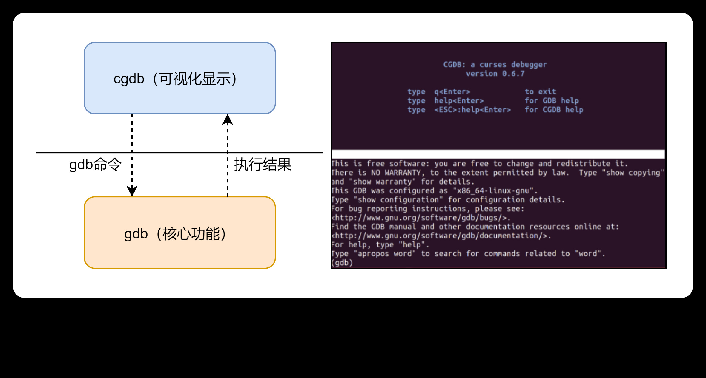

## Linux下CGDB使用教程(转载)

cgdb是一款轻量级的基于gdb的命令行可视化工具，关系大致如下：

CGDB(<https://cgdb.github.io/>)基于ncurse，可以让用户用图形化的方式去调试代码，非常方便。
虽然GDB的TUI模式也是图形化，但是很容易产生撕裂现象，需要redraw，用起来难受，而且没有语法高亮。

cgdb的简单使用介绍如下：
1：cgdb分为上下两栏，上面类似于vi窗口（就称之为cgdb窗口吧）显示对应的代码，下面gdb窗口进行调试操作，上下窗口连动，也就是说cgdb窗口里显示的代码会跟随gdb窗口里调试的位置同步进退。
2：按esc键可让输入焦点进入到cgdb窗口，再按i键回到gdb窗口。按其它键也可以进入到cgdb窗口，比如小键盘上的按键（如果此时Num Lock处于打开状态）。
3：cgdb窗口可进行的操作包括:
    - 鼠标滚轮：滚动浏览源代码
    - 按键s: 鼠标滚轮可以滚动浏览gdb的调试窗口
    - 按斜干（/）为在当前文件内搜索，
    - 按o键可以显示当前程序关联的文件列表，
    - 按空格则在当前位置设置/取消断点。
    - 按键-/+：按25%的比例来缩小放大源代码窗口
    - 按键Ctrl+W： 切换源代码窗口和调试窗口的布局（上下/左右）
其他相关的cgdb命令你可以通过按下ESC键把焦点切换到cgdb窗口之后，输入:help回车后查看。
4：最后，你可以通过按下按键i可以重新回到gdb窗口。
最后，执行cgdb可带的命令行参数和gdb类似，比如-p等。

