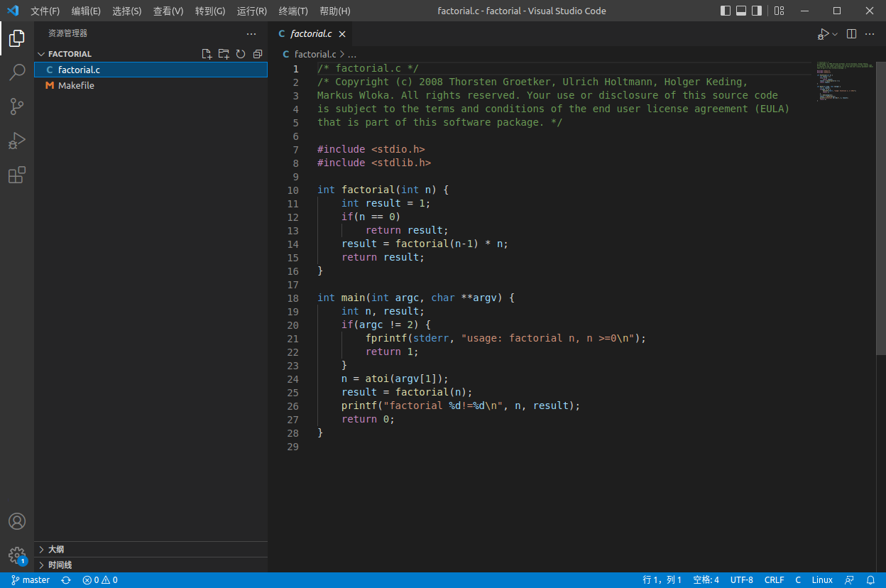
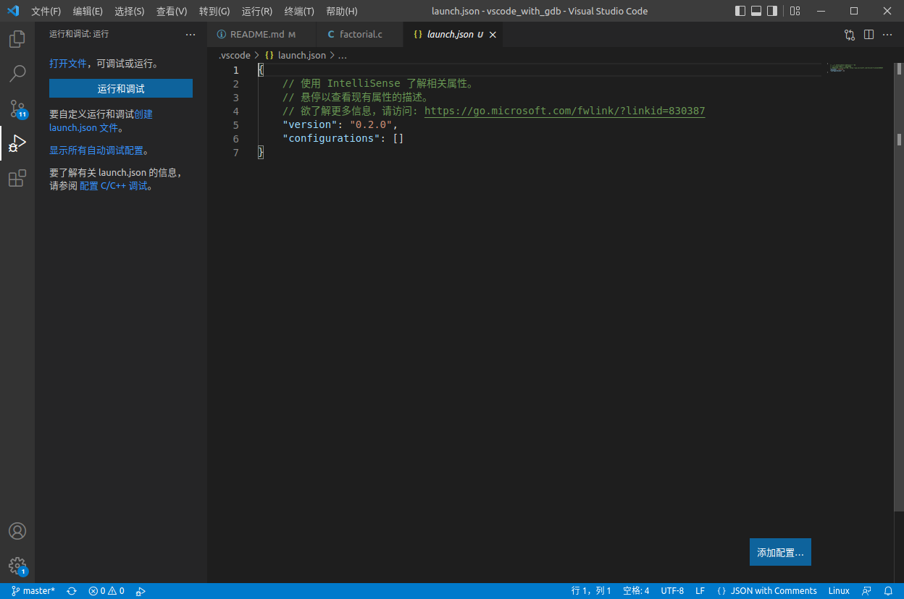
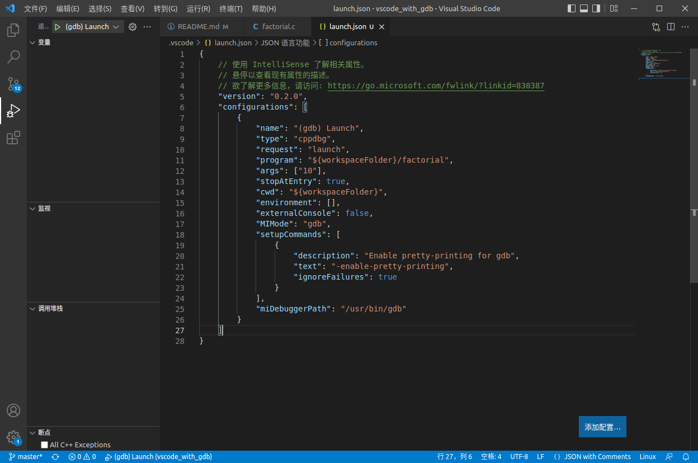
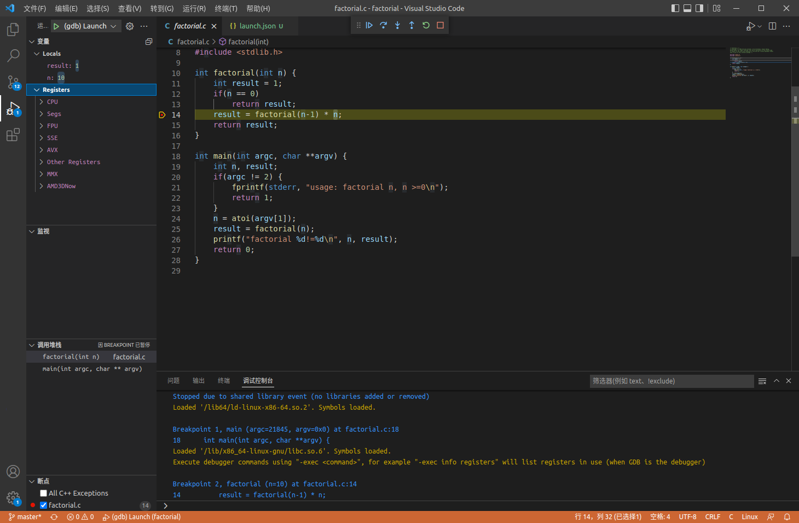

### 在vscode中使用gdb进行调试

#### 1. 打开vscode并启动调试窗口


- 首先打开工作区文件夹




编译项目

```
$ cd factorial
$ make
```

#### 2. 配置launch.json文件

按 `F5` 或点击运行 > 添加配置，选择 "C++ (GDB/LLDB)"。



修改生成的 `launch.json`：

```json
{
    "version": "0.2.0",
    "configurations": [
        {
            "name": "C Debug",
            "type": "cppdbg",
            "request": "launch",
            "program": "${fileDirname}/${fileBasenameNoExtension}",
            "args": [],
            "stopAtEntry": false,
            "cwd": "${workspaceFolder}",
            "environment": [],
            "externalConsole": false,
            "MIMode": "gdb",
            "setupCommands": [
                {
                    "description": "Enable pretty-printing for gdb",
                    "text": "-enable-pretty-printing",
                    "ignoreFailures": true
                }
            ],
            "preLaunchTask": "C Compile"
        }
    ]
}
```

其中需要注意并修改的是：

- program 要调试的程序名（包含路径，最好绝对路径，免得麻烦）
- miDebuggerServerAddress 服务器的地址和端口 （本文没用到）
- cwd 调试程序的路径
- miDebuggerPath gdb 的路径
- args 调试程序的命令行参数列表



按上述配置后即可将 factorial 可执行文件进行 gdb 调试。此时再次按下 F5，即可进入 gdb 调试界面。



```
注：配置 编译 等更多指令

"preLaunchTask": "build" 生成子 task，可在里面编辑 gcc 命令等。
"miDebuggerServerAddress" 配置服务器的地址和端口。
```
