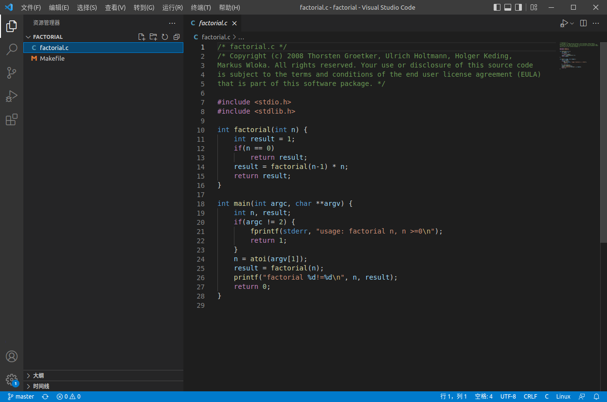
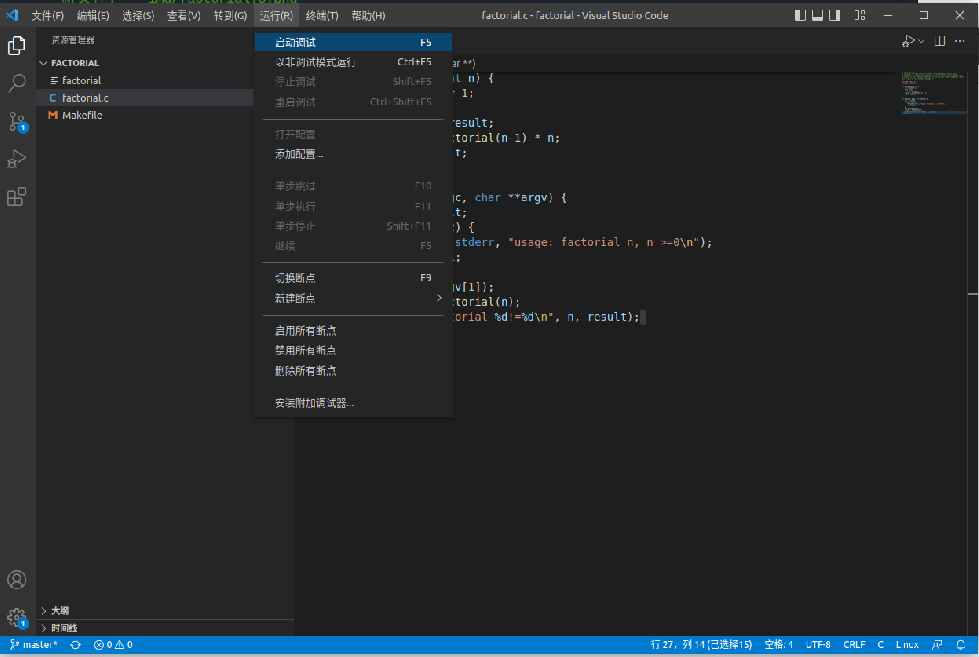
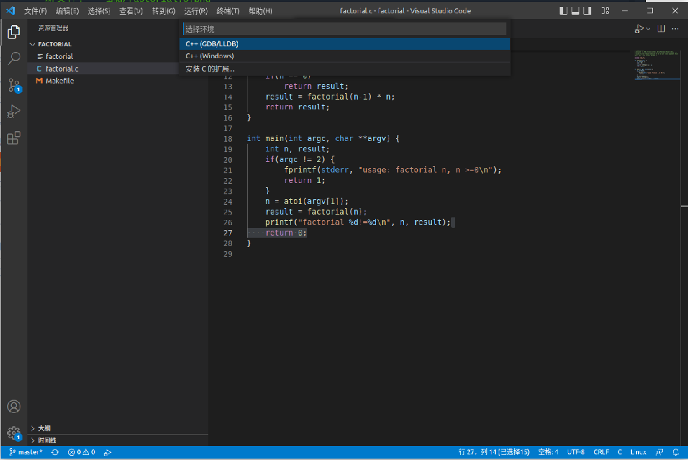
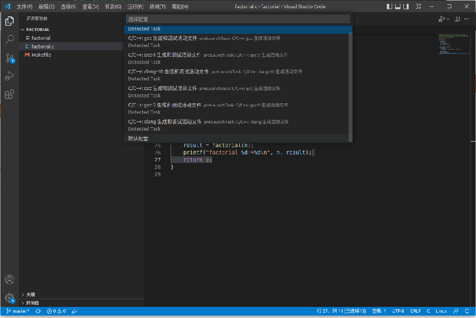
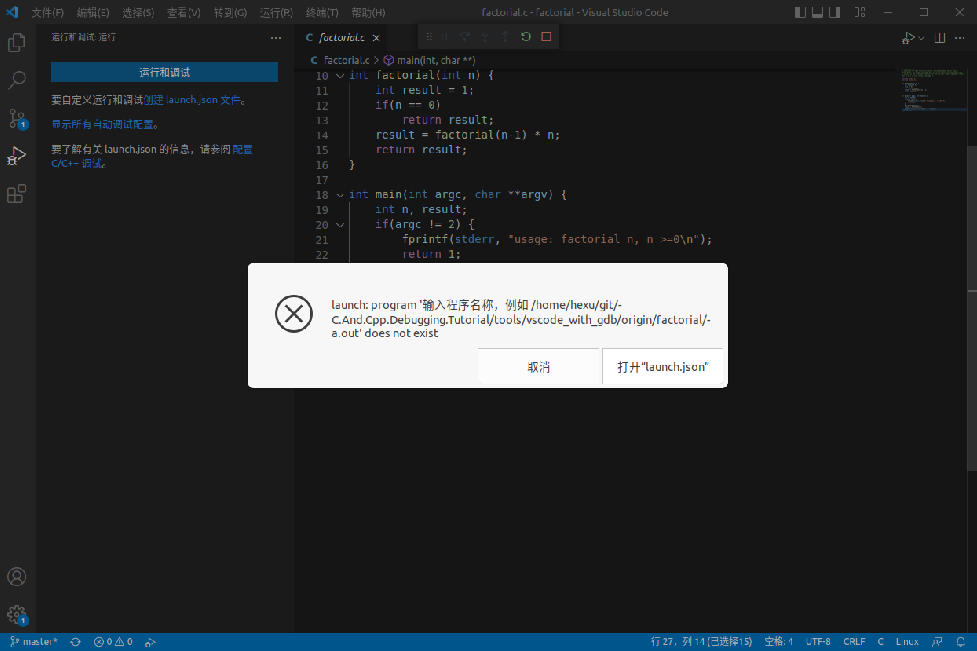
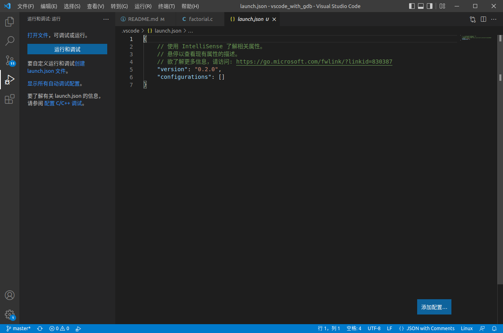
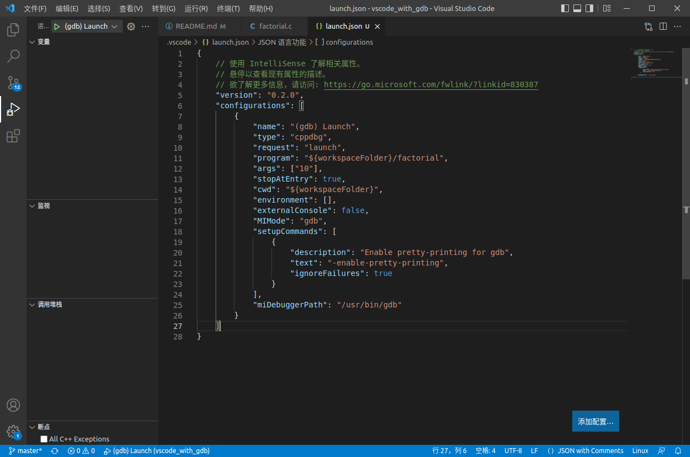
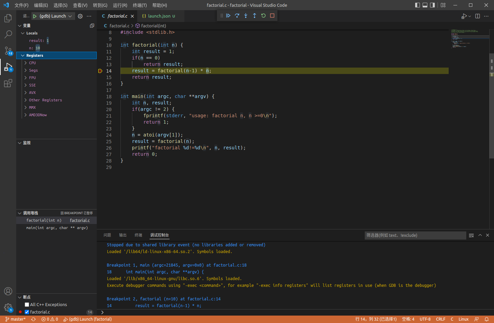

### 在vscode中使用gdb进行调试

#### 1. 打开vscode并启动调试窗口


- 首先打开工作区文件夹




编译项目

```
$ cd factorial
$ make
```

- 启动调试



选择GDB作为调试环境



选择默认配置



会提示你配置文件launch.json不存在，点击Open launch.json，然后开始下一步的launch.json配置。



#### 2. 配置launch.json文件

在上一步结束后，我们可以看到 launch.json 界面。



其中需要注意并修改的是：

- program 要调试的程序名（包含路径，最好绝对路径，免得麻烦）
- miDebuggerServerAddress 服务器的地址和端口 （本文没用到）
- cwd 调试程序的路径
- miDebuggerPath gdb 的路径
- args 调试程序的命令行参数列表



按上述配置后即可将 factorial 可执行文件进行 gdb 调试。此时再次按下 F5，即可进入 gdb 调试界面。



```
注：配置 编译 等更多指令

"preLaunchTask": "build" 生成子 task，可在里面编辑 gcc 命令等。
"miDebuggerServerAddress" 配置服务器的地址和端口。
```
